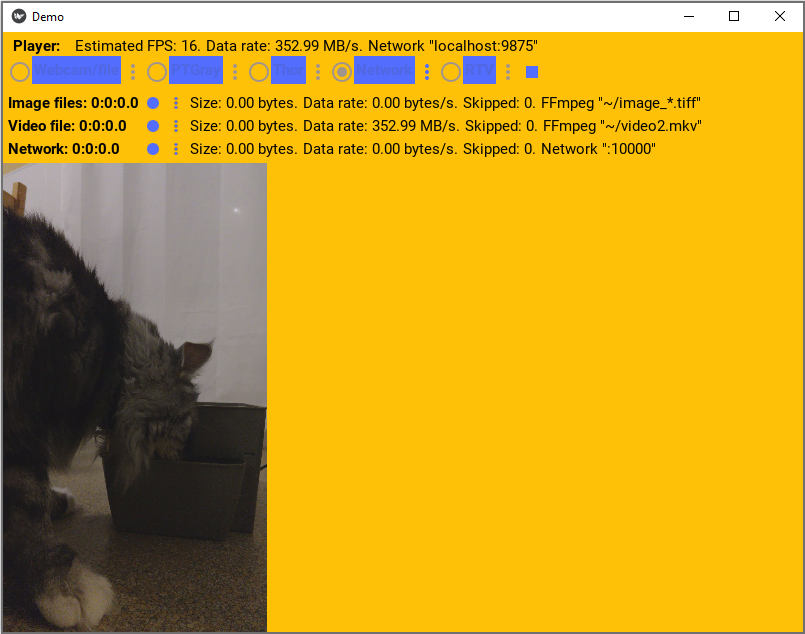

Getting Started
================

Introduction
-------------

cpl_media provides a abstract :class:`cpl_media.player.BasePlayer` and
:class:`cpl_media.recorder.BaseRecorder` class.

The player provides an API that can
be implemented by cameras or other media sources to play video images into
:attr:`cpl_media.player.BasePlayer.frame_callbacks`. Examples cameras are USB webcams,
video files, Thor and Point Gray cameras. Also, playing video from network
streaming.

Recorders provides an API that accepts images from a player through
:attr:`cpl_media.player.BasePlayer.frame_callbacks` and records them somewhere.
Example recorders are saving to videos files, saving to images, or
streaming video to the network.

We also provide Kivy widgets to configure each of the players/recorders, which can
be used in a Kivy app to configure and play/record.

Usage
------

To use cpl_media, you first need to install it, see :ref:`install-cpl_media`.

After it's installed, it can be used like any python library.
Complete API documentation is at :ref:`cpl_media-root-api`.

We provide a :ref:`cpl_media-demo_app` app that uses all the players and
recorders that demos its usage.

Screenshots
-----------

The following image shows a screenshot of the demo app playing a video file and streaming it to
the network as a server.

.. image:: images/player.png

The following image shows a screenshot of the demo app playing the video being streamed
by the server, by acting as a client of the server.

